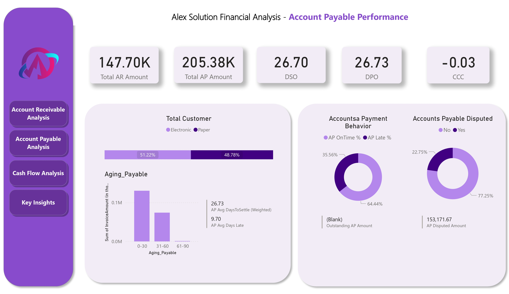
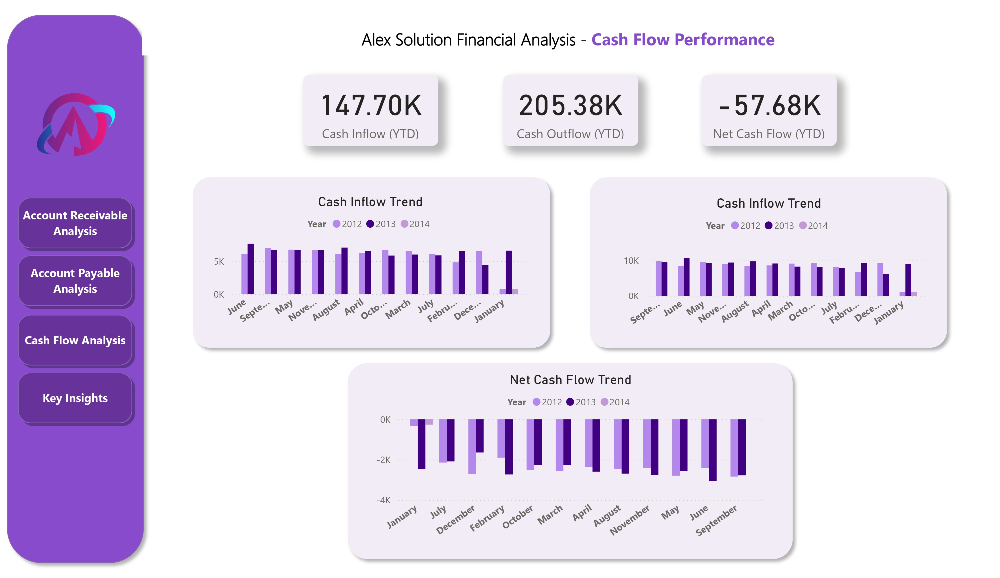
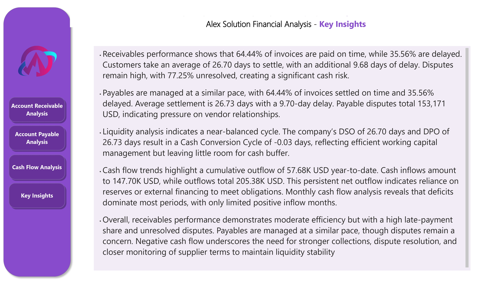

## Project Overview
**Goal:** Provide a dashboard showing liquidity, efficiency, and risk through AR/AP KPIs and cash-flow metrics so finance teams can monitor collections, payments, dispute exposure, and cash runway.

**Key capabilities**
- AR and AP totals, outstanding balances, DSO / DPO / CCC  
- On-time vs late metrics and average days late (amount-weighted)  
- Disputed invoice counts and amounts  
- Historical payment-behaviour aging (DaysToSettle)  
- Outstanding (current) aging buckets (As-Of date)  
- Cash inflow/outflow, net cash flow, cumulative cash balance and rolling cash  
- Country / Customer / Supplier drilldowns and top lists  
- Dynamic date-role switching (InvoiceDate / DueDate / SettledDate)  

---

## Key Insights
- **Receivables:** 64.44% of invoices are paid on time while 35.56% are delayed. Average settlement time is 26.70 days with an additional delay of 9.68 days. Disputes are significant, with 77.25% unresolved, creating a cash-flow risk.  
- **Payables:** 64.44% of invoices are paid on time and 35.56% are delayed. Average settlement is 26.73 days with a 9.70-day delay. Disputed payables total 153,171 USD, which may affect vendor relationships.  
- **Liquidity:** DSO and DPO are nearly equal, resulting in a Cash Conversion Cycle of -0.03 days. This reflects efficiency but limited flexibility.  
- **Cash Flow:** YTD inflows are 147.70K USD while outflows are 205.38K USD, producing a net outflow of -57.68K USD. Negative cash flow highlights reliance on reserves or financing.  

Overall, receivables performance is moderate but late payments and disputes are a concern. Payables are managed similarly, though disputes require attention. Sustained negative cash flow underscores the need for stronger collections, faster dispute resolution, and closer monitoring of supplier terms.

---

## Dashboard Previews

### Overall Financial Health Dashboard


### Accounts Receivable Analysis


### Accounts Payable Analysis


### Cash Flow Dashboard


---

## Data Model
**Fact tables**
- `Fact_AR` (Accounts Receivable)  
  Columns: `InvoiceNumber`, `CustomerID`, `CountryCode`, `InvoiceDate`, `DueDate`, `SettledDate`, `InvoiceAmount`, `Disputed`, `PaperlessDate`, `DaysToSettle`, `DaysLate`

- `Fact_AP` (Accounts Payable)  
  Columns: `InvoiceNumber`, `SupplierID`, `CountryCode`, `InvoiceDate`, `DueDate`, `SettledDate`, `InvoiceAmount`, `Disputed`, `PaperlessDate`, `DaysToSettle`, `DaysLate`

**Dimension tables**
- `Dim_Country` — `CountryCode`, `CountryName`  
- `Dim_Date` — dynamic calendar table (see DAX below). Mark as Date table.  
- `AgingBuckets` — `BucketID`, `BucketName`, `MinDays`, `MaxDays`

---

## Key DAX Snippets

### Dim Date (dynamic range across facts)
```DAX
Dim_Date =
VAR DatesAP =
    UNION(
        SELECTCOLUMNS(Fact_AP, "Date", Fact_AP[InvoiceDate]),
        SELECTCOLUMNS(Fact_AP, "Date", Fact_AP[DueDate]),
        SELECTCOLUMNS(Fact_AP, "Date", Fact_AP[SettledDate])
    )
VAR DatesAR =
    UNION(
        SELECTCOLUMNS(Fact_AR, "Date", Fact_AR[InvoiceDate]),
        SELECTCOLUMNS(Fact_AR, "Date", Fact_AR[DueDate]),
        SELECTCOLUMNS(Fact_AR, "Date", Fact_AR[SettledDate])
    )
VAR AllDates = DISTINCT(UNION(DatesAP, DatesAR))
VAR MinDate = MINX(FILTER(AllDates, NOT(ISBLANK([Date]))), [Date])
VAR MaxDate = MAXX(FILTER(AllDates, NOT(ISBLANK([Date]))), [Date])
RETURN
ADDCOLUMNS(
    CALENDAR( DATE(YEAR(MinDate), MONTH(MinDate), DAY(MinDate)), DATE(YEAR(MaxDate), MONTH(MaxDate), DAY(MaxDate)) ),
    "Year", YEAR([Date]),
    "Month Number", MONTH([Date]),
    "Month Name", FORMAT([Date], "MMMM"),
    "Year-Month", FORMAT([Date], "yyyy-MM"),
    "Quarter", "Q" & FORMAT(ROUNDUP(MONTH([Date]) / 3, 0), "0"),
    "Weekday Number", WEEKDAY([Date], 2),
    "Weekday Name", FORMAT([Date], "dddd"),
    "IsWeekend", IF(WEEKDAY([Date], 2) > 5, TRUE(), FALSE())
)
